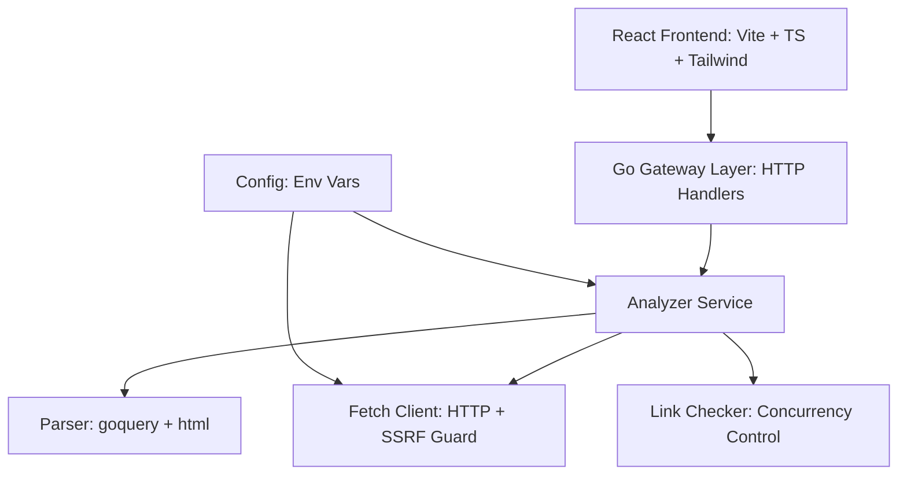

# Page Analyzer – Architecture

## 1. Overview
The Page Analyzer backend is a Go-based JSON API that fetches and analyzes web pages.  
It extracts:
- HTML version
- Title
- Heading structure (h1–h6)
- Internal/external links
- Inaccessible links
- Presence of login forms

A React frontend consumes this API.

---

## 2. High-Level Architecture

----

## 3. Layered Design

### Gateway (`internal/gateway`)
- Exposes `/api/analyze` JSON API.
- Validates request body, ensures URL is well-formed.
- Handles errors with proper HTTP status codes.
- Delegates analysis work to `analyzer.Service`.

---

### Analyzer (`internal/analyzer`)
- Orchestrates fetch, parse, and link validation.
- Applies **context-based timeouts**.
- Produces a structured `contract.AnalyzeResult`.

---

### Fetch (`internal/fetch`)
- Wraps `http.Client`.
- Enforces:
  - Redirect limits
  - Max response size
  - SSRF protection (blocks private IPs by default)
  - Configurable timeouts

---

### Parser (`internal/parser`)
- Uses `goquery` + `x/net/html`.
- Extracts:
  - Title
  - Headings (h1–h6)
  - Links
  - Doctype (HTML5, XHTML, HTML4.x, unknown)
  - Login form presence

---

### Link Checker (`internal/linkcheck`)
- Concurrently validates links with `HEAD`/`GET`.
- Enforces:
  - Global concurrency limit
  - Per-host concurrency limit
- Uses per-link timeout.

---

### Config (`internal/config`)
- Loads runtime parameters from environment:
  - `PORT`
  - `FETCH_TIMEOUT_SECONDS`
  - `FETCH_MAX_REDIRECTS`
  - `FETCH_MAX_BYTES`

---

## 4. Key Decisions & Tradeoffs

- **Security-first fetch** with SSRF guard and size caps prevents misuse.
- **Timeouts** applied at every stage ensure responsiveness but can lead to false negatives if too strict.
- **Concurrency limits** prevent system overload when analyzing pages with many links.
- **Frontend/Backend split** enables independent evolution and deployment.

---

## 5. Observability

Structured logging is included at key points; future improvements can add Prometheus metrics and OpenTelemetry tracing.

---

## 6. Testing Strategy

Unit tests cover analyzer orchestration, fetch client behavior, parser accuracy, link checker concurrency, and gateway API responses.  
Integration tests simulate full `/api/analyze` requests against local fake HTML pages.

---

## 7. Deployment

Backend is a Go binary (Dockerized with small base image).  
Frontend is a React build served from a static host (Netlify, S3+CloudFront).  
Configuration is injected via environment variables; health check available at `/healthz`.

---