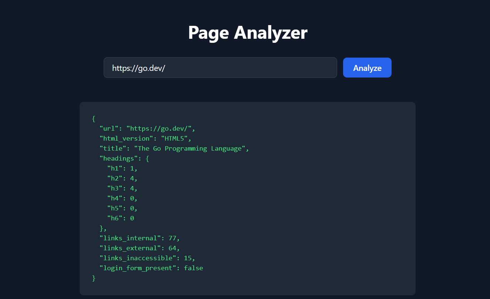

# Page Analyzer – Architecture

## 1. Overview
Page Analyzer is a cloud-ready web application with a **Go backend** and a **React + TypeScript frontend**.

It analyzes web pages to extract:
- HTML version
- Title
- Heading structure (h1–h6)
- Internal vs external links
- Inaccessible/broken links
- Presence of login forms

A React frontend consumes this API.

---

## 2. High-Level Architecture

---

## 3. Layered Design

### Gateway (`internal/gateway`)
- Exposes REST API `/api/analyze` and `/healthz`.
- Validates request JSON with regex + url.Parse.
- Unified error responses for frontend.
- Wraps handlers with **CORS, structured logging, Prometheus middleware**.

### Analyzer (`internal/analyzer`)
- Orchestrates **fetch → parse → classify → validate links**.
- Applies **timeouts at every stage** using context.Context.
- Uses concurrency + cancellation to handle large pages efficiently.
- Produces structured `AnalyzeResult` DTO for frontend consumption.

### Fetch (`internal/fetch`)
- Hardened HTTP client with:
    - Redirect limits
    - Max response size caps
    - **SSRF guard** (blocks local/private IPs)
    - Configurable request timeouts
- Supports toggle for local testing.

### Parser (`internal/parser`)
- Uses `goquery` + `golang.org/x/net/html` to parse DOM.
- Extracts metadata:
    - Doctype → infer HTML version
    - `<title>` tag
    - Headings (h1–h6) counts
    - Anchor links
    - Login form detection (password fields heuristic).

### Link Checker (`internal/linkcheck`)
- Validates links concurrently with **worker pools**.
- Global + per-host concurrency limits prevent overload.
- Uses **HEAD requests with per-link timeouts**.
- Returns structured results with status codes and errors.

### Config (`internal/config`)
- Injected from **environment variables** (12-Factor compliant):
    - `PORT`, `FETCH_TIMEOUT_SECONDS`, `FETCH_MAX_REDIRECTS`, `FETCH_MAX_BYTES`

---

## 4. Cloud & Microservice Readiness

- **12-Factor principles**: stateless service, config via env vars, health checks.
- **Observability**: structured logs (slog), Prometheus metrics, optional pprof profiling.
- **Security-first fetch**: SSRF guard, size caps, redirect control.
- **Scalability**:
    - Horizontally scalable (stateless containers).
    - Concurrency limits in link checker avoid noisy-neighbor issues.
- **Deployability**:
    - Dockerized backend + frontend.
    - Compose for local dev, Kubernetes manifests can be added for cloud.
- **Service Decomposition Future**:
    - Analyzer can be split into microservices (e.g., FetchService, ParseService, LinkService) connected via a message bus.

---

## 5. Observability

- **Logging**: Structured logs with `slog`, contextual fields (url, duration, errors).
- **Metrics**: Prometheus counters/histograms for requests, errors, latencies.
- **Profiling**: Go `pprof` exposed on dedicated port.
- **Health Probes**: `/healthz` endpoint for container orchestration (K8s, ECS).

---

## 6. Testing

- **Unit tests**: analyzer, fetch client, parser, link checker, gateway.
- **Integration tests**: run full `/api/analyze` against local test servers.
- **Coverage**: ~80% (excluding glue/config/bootstrap).
- **CI-ready**: can run in GitHub Actions or GitLab CI with `make coverage`.

---

## 7. Deployment

- Backend → small Go binary (multi-stage Docker build).
- Frontend → React static build served via nginx.
- Docker Compose → for local dev.
- Config via env vars injected at runtime.

---

## 8. Frontend UI

- Success response

- Error response 

---

## 9. Future Improvements

- Caching results.
- Authentication & rate limiting.
- CI/CD pipelines with Docker image publishing.
- UI improvements in Frontend
